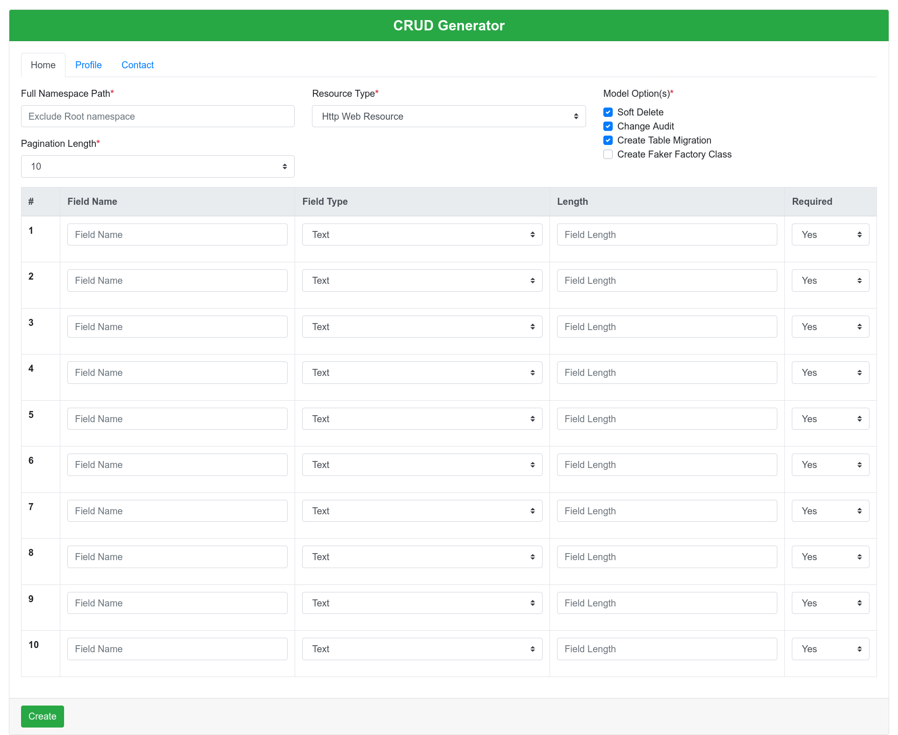

# Laravel CRUD Generator

[](https://packagist.org/packages/hafijul233/generator)
[](https://github.com/hafijul233/generator/actions?query=workflow%3Arun-tests+branch%3Amain)
[](https://github.com/hafijul233/generator/actions?query=workflow%3A"Check+%26+fix+styling"+branch%3Amain)
[](https://packagist.org/packages/hafijul233/generator)

This is where your description should go. Limit it to a paragraph or two. Consider adding a small example.

## Installation

You can install the package via composer:

```bash
composer require hafijul233/generator
```

You can publish and run the migrations with:

```bash
php artisan vendor:publish --tag="generator-migrations"
php artisan migrate
```

You can publish the config file with:

```bash
php artisan vendor:publish --tag="generator-config"
```

This is the contents of the published config file:

```php
return [

    'root_namespace' => 'App',

    'root_path' => base_path('app'),

    'resource_types' => [
        'options' => [
            'api' => 'Api Resource',
            'web' => 'Http Web Resource',
        ],

        'default' => 'web',
    ],

    'model_options' => [
        'soft-delete' => 'Soft Delete',
        'audit' => 'Change Audit',
        'migration' => 'Create Table Migration',
        'factory' => 'Create Faker Factory Class',
    ],

    'model_defaults' => [
        'soft-delete',
        'audit',
        'migration',
    ],

    'field_types' => [
        'Text Fields' => [
            'text' => 'Text',
            'email' => 'Email',
            'password' => 'Password',
            'url' => 'Website URL',

            'textarea' => 'Large Text (Textarea)',
        ],
        'Checkbox/Radio Fields' => [
            'checkbox' => 'Checkbox',
            'radio' => 'Radio',
            'select' => 'Select',
            'multi-select' => 'Multiple Select',

        ],
        'Number Fields' => [
            'integer' => 'Integer',
            'float' => 'float',
            'money' => 'Money',
            'mobile' => 'Mobile',
        ],
        'Date Time Fields' => [
            'date' => 'Only Date',
            'time' => 'Only Time',
            'datetime' => 'Date Time',
            'month' => 'Month Jan(1)-Dec(12)',
            'year' => 'Year(1971-~)',
        ],
        'Slider Dropdown Fields' => [
            'range' => 'Range Slider',
            'range-dropdown' => 'Select Range Dropdown',
        ],
        'File Fields' => [
            'file' => 'Default file uploader',
            'image' => 'Image uploader with preview',
        ],
        'Relation Fields' => [
        ],
    ],

    'migration_types' => [
        'text' => 'string',
        'email' => 'string',
        'password' => 'string',
        'url' => 'string',
        'textarea' => 'text',
        'checkbox' => 'array',
        'radio' => 'unsignedBigInteger',
        'select' => 'unsignedBigInteger',
        'multi-select' => 'unsignedBigInteger',
        'integer' => 'unsignedBigInteger',
        'float' => 'double',
        'money' => 'double',
        'mobile' => 'string',
        'date' => 'date',
        'time' => 'time',
        'datetime' => 'dateTime',
        'month' => 'smallInteger',
        'year' => 'year',
        'range' => 'smallInteger',
        'range-dropdown' => 'smallInteger',
        'file' => 'string',
        'image' => 'string',
    ],

    'pagination' => [
        'options' => [
            5 => '5',
            10 => '10',
            25 => '25',
            50 => '50',
            75 => '75',
            100 => '100',
            250 => '250',
            500 => '500',
        ],
        'default' => 10,
    ],
];
```

Optionally, you can publish the views using

```bash
php artisan vendor:publish --tag="generator-views"
```

## Testing

```bash
composer test
```

## Changelog

Please see [CHANGELOG](CHANGELOG.md) for more information on what has changed recently.

## Contributing

Please see [CONTRIBUTING](https://github.com/hafijul233/.github/blob/main/CONTRIBUTING.md) for details.

## Security Vulnerabilities

Please review [our security policy](../../security/policy) on how to report security vulnerabilities.

## Credits

- [Mohammad Hafijul Islam](https://github.com/hafijul233)
- [All Contributors](../../contributors)

## License

The MIT License (MIT). Please see [License File](LICENSE.md) for more information.

## Interface


